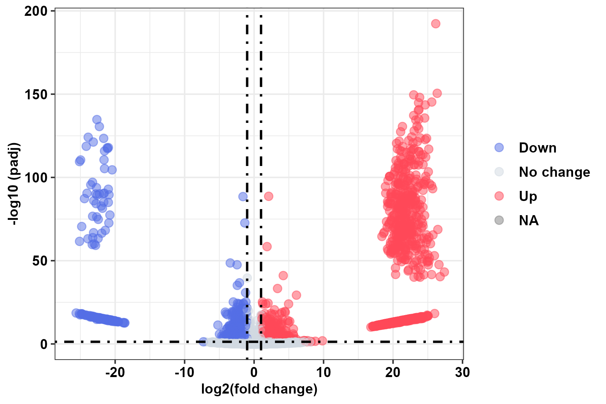
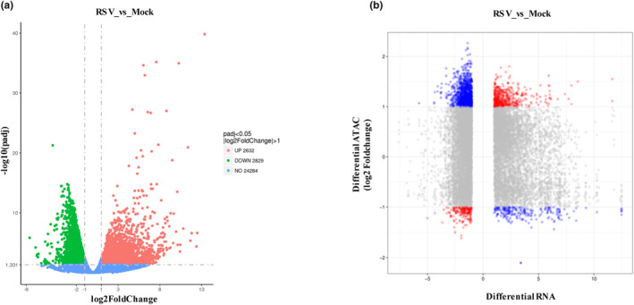
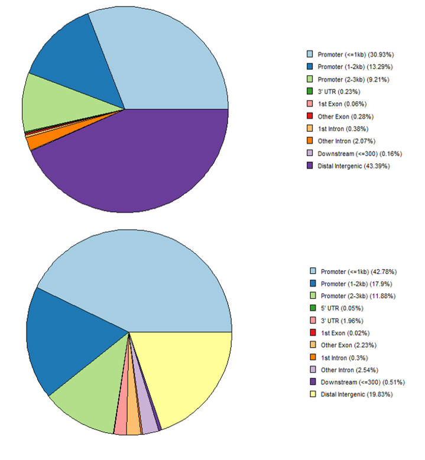
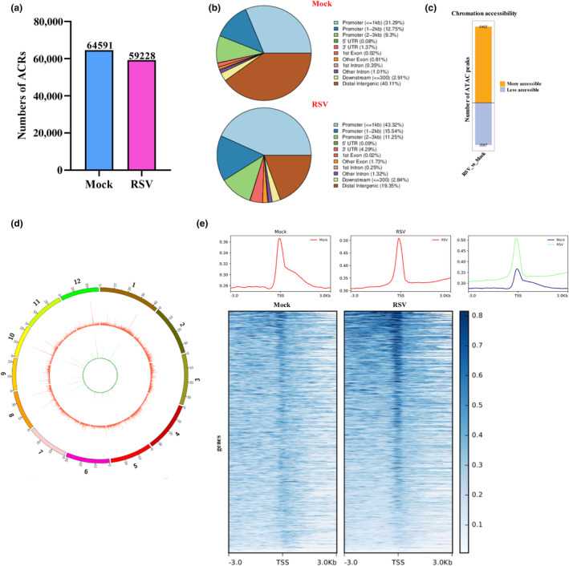
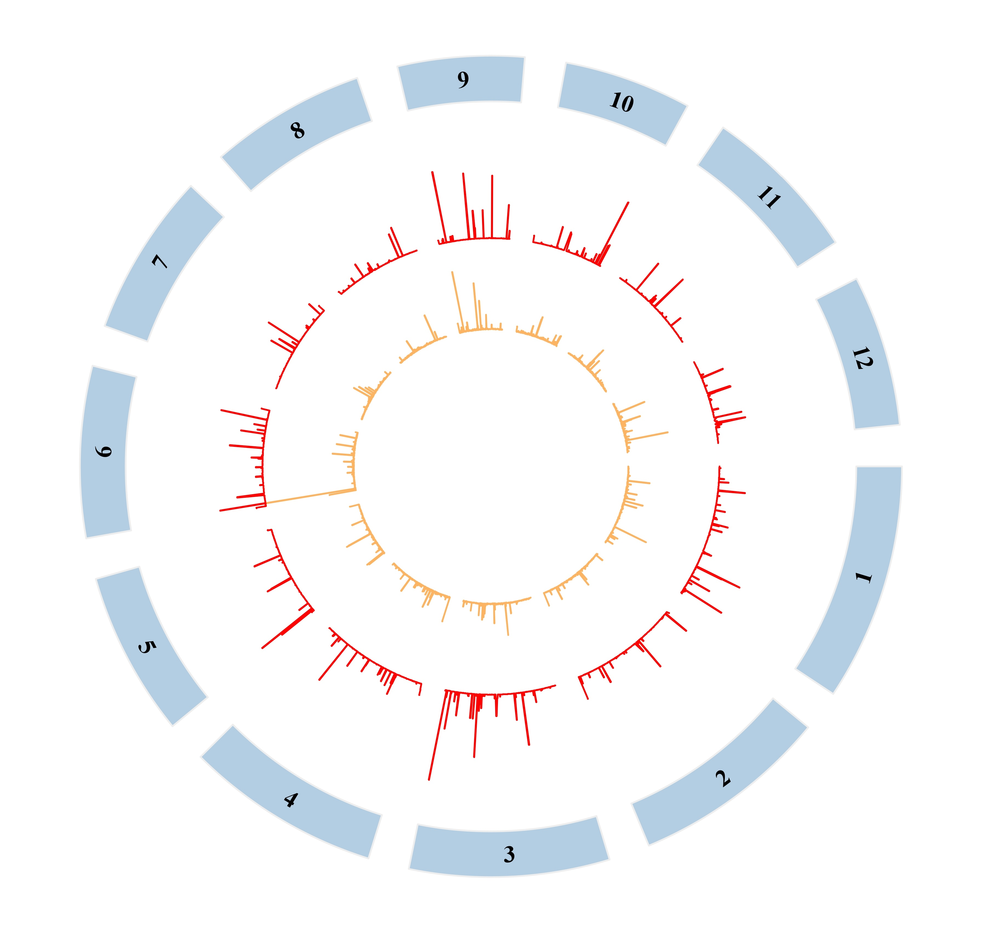
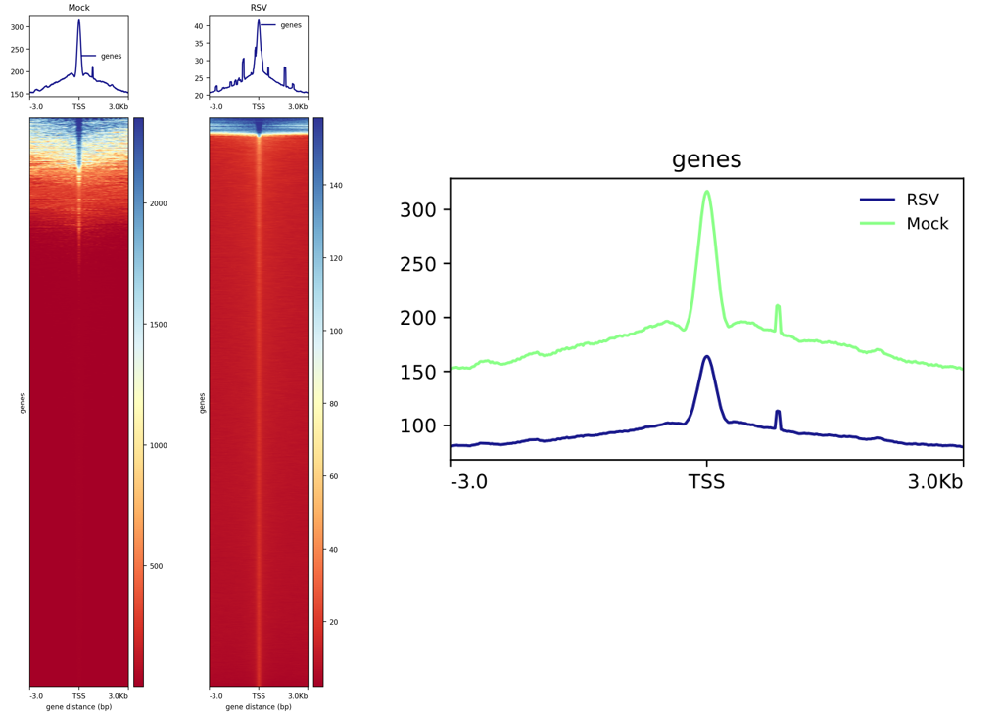

文章题为"Integrated ATAC‐seq and RNA‐seq data analysis identifies transcription factors related to rice stripe virus infection in Oryza sativa"。该文章发表于 Molecular Plant Pathology（中科院一区，IF=4.9，第一作者：Miaomiao Li，通讯作者：Yuwen Lu）。

此处对该文章的 RNA-seq 与 ATAC-seq 数据分析部分进行复现，所得出的数据文件均在此仓库。

> 关于结果的差异，作者回复：bam 需采用去重 pcr 的 reads；macs2 pileup 对 uniq 去重复的 bam 来计算 reads 堆积，然后归一化，到 per 1M reads 最后 bedGraphToBigWig  转化为 bw, 在可视化展示。

## RNA-seq

RNA-seq 测序的原始数据在 NCBI SRA 数据库：[PRJNA1080249](https://www.ncbi.nlm.nih.gov/bioproject/?term=PRJNA1080249)。

原文材料与方法：`For RNA‐seq analysis, the raw data (raw reads) of fastq format were first processed through in‐house Perl scripts. In this step, clean data (clean reads) were obtained by removing reads containing adapter, reads containing poly‐N and low‐quality reads from raw data. At the same time, Q20, Q30 and GC content in the clean data were calculated. The resulting reads were mapped to the rice reference genome using HISAT2 (v. 2.0.5) with default parameters (Kim et al., 2015). The mapped reads of each sample were assembled by StringTie (v. 1.3.3b) (Pertea et al., 2015). FeatureCounts (v. 1.5.0‐p3) was used to count the reads numbers mapped to each gene (Liao et al., 2014). And then fragments per kilobase million (FPKM) of each gene was calculated based on the length of the gene and reads count mapped to this gene. Differential expression analysis of RSV infection and Mock infection was performed using the DESeq2 R package (v. 1.16.1) at the threshold of log2(fold change) ≥ |1| and the adjusted p‐value <0.05 (Love et al., 2014).`

使用 SRA Run Selector 生成 SRR_Acc_List.txt 文件，便于下载和进行后续分析，使用 sra-tools 下载测序数据：

```bash
nohup prefetch -O . $(<SRR_Acc_List.txt) &
```

将每个文件夹中的 sra 文件移动到 sra 文件夹：

```bash
cat ./SRR_Acc_List.txt | while read id; do
    mv -f "${id}/${id}.sra" ./sra
    rm -rf "${id}"
done
```

将 sra 文件解压为 fastq.gz 文件并输出到 fastqgz 文件夹：

```bash
nohup fastq-dump --gzip --split-3 ./sra/*.sra --outdir ./fastqgz &
```

使用 trim_galore 进行数据清洗：

```bash
cat ./SRR_Acc_List.txt | while read id; do 
    trim_galore \
    -q 20 \
    --length 36 \
    --max_n 3 \
    --stringency 3 \
    --fastqc \
    --paired \
    -o ./clean/ \
    ./fastqgz/${id}_1.fastq.gz ./fastqgz/${id}_2.fastq.gz
done
```

从 Ensembl Plant 下载水稻基因组：

```bash
wget https://ftp.ensemblgenomes.ebi.ac.uk/pub/plants/release-58/fasta/oryza_sativa/dna/Oryza_sativa.IRGSP-1.0.dna.toplevel.fa.gz
gzip -d Oryza_sativa.IRGSP-1.0.dna.toplevel.fa.gz
```

使用 hisat 构建索引并将 reads 比对到参考基因组：

```bash
hisat2-build -p 4Oryza_sativa.IRGSP-1.0.dna.toplevel.fa Oryza_sativa
```

```bash
cat ./SRR_Acc_List.txt | while read id;do
    hisat2 \
    -x ./genome_index/${species} \
    -p 5 \
    -1 ./clean/${id}_1.fastq.gz \
    -2 ./clean/${id}_2.fastq.gz \
    -S ./compared/${id}.sam
done
```

使用 samtools 进行排序压缩：

```bash
cat ./SRR_Acc_List.txt | while read id ;do
    samtools \
    view \
    -@ 4 \
    -bS ./compared/${id}.sam | samtools \
    sort \
    -@ 4 \
    -o ./sorted/${id}.bam
done
```

从 Ensembl Plant 下载水稻注释文件：

```bash
wget https://ftp.ensemblgenomes.ebi.ac.uk/pub/plants/release-58/gff3/oryza_sativa/Oryza_sativa.IRGSP-1.0.58.gff3.gz
gzip -d Oryza_sativa.IRGSP-1.0.58.gff3.gz
```

使用 stringtie 进行转录本组装：

```bash
cat ./SRR_Acc_List.txt | while read id ;do
    stringtie -p 8 \
    -e \
    -G ${gtf} \
    -o assembled.gtf \
    ./sorted/${id}.bam
done
```

- -p 8：指定线程数，这里设置为 8
- -e：表示输出所有样本的每个基因的预测表达量估计值
- -G：指定参考基因组的注释文件
- -o assembled.gtf：指定输出文件的名称为 assembled.gtf，即组装后的转录本结果

这里如果不指定-e 参数的话，组装后的转录本无法使用基因原有的 ID 进行定量。

使用 stringtie 组装的 gtf 注释文件进行定量：

```bash
cd ./sorted
bam=$(ls *)
featureCounts \
-T 5 \
-t exon \
-g Parent \
-a assembled.gtf \
-o counts \
-p ${bam}
```

对 counts 矩阵进行 fpkm 标准化：

```R
counts <- read.csv(
    './counts',
    header = TRUE,
    sep = '\t',
    comment.char = '#',
    check.names = FALSE
)
for (clm in colnames(counts)[6:ncol(counts)]) {
    col_fpkm <- paste0(clm, "_FPKM")     # 新列的名称，加上"_FPKM"后缀
    total <- sum(counts[, clm])          # 计算每个样本的总读数
    counts[col_fpkm] <- (counts[, clm] * 10^6) / (counts[, "Length"] / 1000)  # 使用相应样本的长度值计算 FPKM 并添加 FPKM 列
}
numeric_mask <- sapply(counts, is.numeric)
counts[numeric_mask] <- lapply(counts[numeric_mask], function(x) ifelse(x < 1, x + 1, x))

write.table(counts, file = 'fpkm_output', sep = '\t', row.names = FALSE)
```

使用 DESeq2 包进行差异表达分析：

```r
library(DESeq2)

fpkm = read.csv(
    'fpkm_output', 
    header = T,  
    sep = '\t', 
    row.names = "Geneid", 
    comment.char = '#', 
    check.name = F
)

fpkm <- round(fpkm)
numeric_mask <- sapply(fpkm, is.numeric)
fpkm[numeric_mask] <- lapply(fpkm[numeric_mask], function(x) ifelse(is.numeric(x) & x < 1, x + 100, x))
fpkm <- fpkm[rowSums(fpkm)>10, ]
fpkm[-1, ] <- apply(fpkm[-1, ], 2, as.integer)
missing_values <- sum(is.na(fpkm))
if (missing_values > 0) {
  fpkm <- na.omit(fpkm)
}

samples = data.frame(
    sampleID = c("RSV_1", "RSV_2", "RSV_3", "Mock_1", "Mock_2", "Mock_3"), 
    sample = c("sample1", "sample1", "sample1", "sample2", "sample2", "sample2")
)

rownames(samples) = samples$sampleID
samples$sample = factor(samples$sample, levels = c('sample1', 'sample2'))
dds = DESeqDataSetFromMatrix(countData = fpkm, colData = samples, design = ~sample)

dds_count <- DESeq(dds, fitType = 'mean', minReplicatesForReplace = 7, parallel = FALSE)

sampl1_vs_sample2 <- results(dds_count, contrast = c('sample', 'sample1', 'sample2'))
result <- data.frame(sampl1_vs_sample2, stringsAsFactors = FALSE, check.names = FALSE)
write.table(result, 'sampl1_vs_sample2.DESeq2.txt', col.names = NA, sep = '\t', quote = FALSE)
```

根据阈值 padj < 0.05 筛选出 6391 个差异基因；根据阈值| log2FC | > 1 筛选出 2363 个上调基因和 2380 个下调基因。这与原文结果`Based on three biological replicates, a total of 5461 genes were identified with significant changes after RSV infection. Of these, 2632 genes were up‐regulated and 2829 genes were down‐regulated`相差不大。

使用 ggplot2 包绘制火山图：

```r
library(ggplot2)

data <- read.table('./sampl1_vs_sample2.DESeq2.txt', header = TRUE)
data <- as.data.frame(data)

cut_off_padj = 0.05
cut_off_logFC = 1

data$change <- ifelse (
    data$padj < cut_off_padj & abs(data$log2FoldChange) >= cut_off_logFC, 
    ifelse(data$log2FoldChange > cut_off_logFC, 'Up', 'Down'),
    'No change'
)

p <- ggplot(
    data,
    aes(
        x = log2FoldChange,
        y = -log10(padj),
        colour = change,
    ))+
    geom_point(
        alpha = 0.5,
        size = 2.5,
    )+
    scale_color_manual(values = c("#546de5", "#d2dae2", "#ff4757"))+
    geom_vline(xintercept = c(-1, 1), lty = 4, col = "black", lwd = 0.8)+
    geom_hline(yintercept = -log10(cut_off_padj), lty = 4, col = "black", lwd = 0.8)+
    labs(
        x = "log2(fold change)",
        y = "-log10 (padj)"
    )+
    theme_bw()+
    theme(
        axis.title.x = element_text(face = "bold", colour = "black", size = 10),  # 修改 X 轴标签字体大小
        axis.title.y = element_text(face = "bold", colour = "black", size = 10),  # 修改 Y 轴标签字体大小
        axis.text = element_text(face = "bold", colour = "black", size = 10),  # 修改轴刻度字体大小
        legend.position = "right",
        legend.title = element_blank(),
        legend.text = element_text(face = "bold", colour = "black", size = 10)  # 修改图例文本字体大小
    )
plot <- p
plot

ggsave(plot, filename = "volcano.png", width = 6, height = 4, dpi = 300)
```



差异基因在数量上与原文的都相差不大，但是火山图相差比较大。



## ATAC-seq

ATAC-seq 测序的原始数据在 NCBI SRA 数据库：[PRJNA1080287](https://www.ncbi.nlm.nih.gov/bioproject/?term=PRJNA1080287)。

原文材料与方法：`For ATAC‐seq analysis, sequences were first trimmed from the reads using skewer (v. 0.2.2) (Jiang et al., 2014). These reads were aligned to a reference genome using Burrows Wheeler aligner (BWA), with standard parameters. These reads were then filtered for high quality (MAPQ ≥13), nonmitochondrial chromosome and properly paired reads (longer than 18 nucleotides). All peak calling was performed with Macs2 (v. 2.1.0) using ‘macs2 callpeak ‐‐ nomodel ‐‐ keep‐dup all ‐‐ call‐summits’ (Zhang et al., 2008). For simulations of peaks called per input read, aligned and de‐duplicated BAM files were used without any additional filtering.`

根据原文的步骤进行复现。

使用 SRA Run Selector 生成 SRR_Acc_List.txt 文件，便于下载和进行后续分析，使用 sra-tools 下载测序数据：

```bash
nohup prefetch -O . $(<SRR_Acc_List.txt) &
```

将每个文件夹中的 sra 文件移动到 sra 文件夹：

```bash
cat ./SRR_Acc_List.txt | while read id; do
    mv -f "${id}/${id}.sra" ./sra
    rm -rf "${id}"
done
```

将 sra 文件解压为 fastq.gz 文件并输出到 fastqgz 文件夹：

```bash
nohup fastq-dump --gzip --split-3 ./sra/*.sra --outdir ./fastqgz &
```

使用 skewer 进行数据清洗：

```bash
cat ./SRR_Acc_List.txt | while read id ;do
    skewer \
    -t 4 \
    -l 100 \
    -q 30 \
    -Q 30 \
    -m pe \
    -o ${id} ./fastqgz/${id}_1.fastq.gz ./fastqgz/${id}_2.fastq.gz
done
```
- -t 4：指定线程数，这里设置为 4
- -l 100：指定去除接头的最小长度阈值为 100
- -q 30：指定质量过滤的阈值，保留质量大于等于 30 的碱基
- -Q 30：指定用于接头修剪的质量阈值，保留质量大于等于 30 的碱基
- -m pe：指定输入文件是成对的 paired-end reads（PE reads）

使用 bwa 建立索引并将 reads 比对到参考基因组：

```bash
nohup bwa index Oryza_sativa.IRGSP-1.0.dna.toplevel.fa &

cat ./SRR_Acc_List.txt | while read id;do
    bwa mem \
    -v 3 \
    -t 4 \
    ./index/Oryza_sativa.IRGSP-1.0.dna.toplevel.fa \
    ./${id}.fastq.gz ./${id}.fastq.gz \
    -o ./compared/${id}.sam
done
```

使用 macs2 进行 Peak Calling：

```bash
cat ./SRR_Acc_List.txt | while read id;do
    macs2 \
    callpeak \
    --nomodel \
    --keep-dup all \
    --call-summits \
    -t ./sorted/${id}.bam \
    -f BAM \
    -g 3.6e+8 \
    -n ./peaks/${id} \
    --qvalue 0.05
done
```

在 RSV 样本中鉴定出 63011 个 peaks；在 MOCK 样本中鉴定出 9455 个 peaks，这似乎有点问题，原文中 RSV 样本中是 64591 个 peaks 而 Mock 样本中是 59228 个 peaks，但我反复进行了几次结果都是 9455 个。

使用 Chipseek 包对 peaks 进行注释与可视化：

```r
rm(list = ls())  
library("GenomicFeatures")
library("ChIPseeker")
library("txdbmaker")

setwd("D:/Home/OsWRKY-NGS/ATAC-seq")

spombe <- makeTxDbFromGFF("./Oryza_sativa.IRGSP-1.0.57.gff3")

Mock <- readPeakFile('./peaks/Mock.bed')
RSV <- readPeakFile('./peaks/RSV.bed')

Mock_peakAnno <- annotatePeak(Mock, tssRegion =c(-3000, 3000), TxDb = spombe)
RSV_peakAnno <- annotatePeak(RSV, tssRegion =c(-3000, 3000), TxDb = spombe)

plotAnnoPie(Mock_peakAnno)
plotAnnoPie(RSV_peakAnno)
```



结果与原文的结果是非常相似的，几乎一样。



同时使用 TBtools 的 circos 功能展示 peaks 在基因染色体上的位置：



给 bam 文件创建索引：

```bash
cat ./SRR_Acc_List.txt | while read id;do
    samtools index ./sorted/${id}.bam
done
```

计算 ATAC-seq 样本的信号丰度：

```bash
cat ./SRR_Acc_List.txt | while read id;do
    bamCoverage -b ./sorted/${id}.bam -o ./bigwig/${id}.bw --normalizeUsing RPKM
done
```

```bash
cat ./SRR_Acc_List.txt | while read id;do
    computeMatrix reference-point \
    --referencePoint TSS \
    --missingDataAsZero \
    -b 3000 -a 3000 \
    -R ${id}.bed \
    -S ${id}.bw  \
    -o ${id}.TSS.gz
done
```

- --referencePoint TSS：指定参考点为转录起始位点 (TSS)
- --missingDataAsZero：如果数据缺失，则将其视为零处理
- -b 3000 -a 3000：定义参考点附近的区域大小，这里设置为上游和下游各 3000 个碱基
- -R：指定参考文件，${id} 是当前循环中的 ID
- -S：指定测序数据文件，${id}.bw 是当前循环中的 ID 对应的 bigWig 格式的文件
- -o：指定输出文件名，${id}.TSS.gz 是当前循环中的 ID 作为前缀的输出文件名

把计算结果绘制成图像：

```bash
plotHeatmap -m Mock.TSS.gz -out Mock.png
```

将两个样本的折线图绘制在同一图像中：

```bash
cat ./SRR_Acc_List.txt | while read id;do
    computeMatrix reference-point \
    --referencePoint TSS \
    --missingDataAsZero \
    -b 3000 -a 3000 \
    -R Mock.bed \
    -S Mock.bw RSV.bw \
    -o TSS.gz
done
```

```bash
plotProfile --dpi 720 -m TSS.gz -out tss.pdf --plotFileFormat pdf --perGroup
```

这里的信号丰度图像与原文的差别是比较大的，尤其是热图，并且折线图和热图的纵轴标尺也与原文是不同的，猜测是因为前面计算方式不同。

